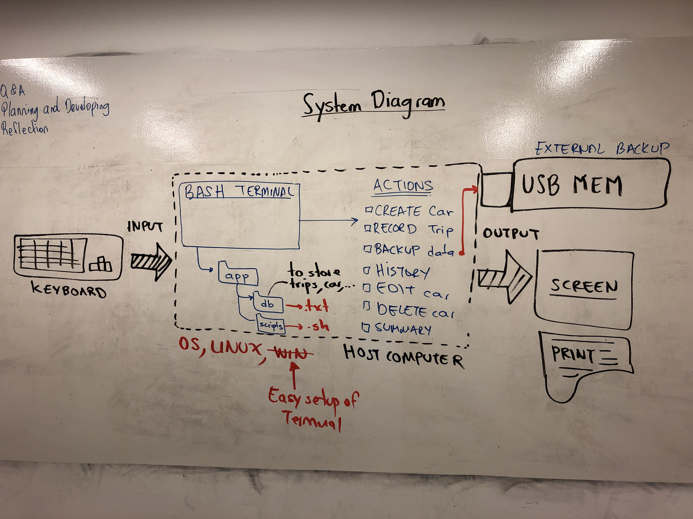

Car Rental Minimal App
===========================

A car rental management minimal app in Bash.

Contents
-----
  1. [Planning](#planning)
  1. [Design](#design)
  1. [Development](#development)
  1. [Evalution](#evaluation)

Planning
----------
### Defining the Problem
A local businessman wishes to pruchase a computational system that would take over his manual process of recording the transactions in his car renting company. He usually records the features of his vehicles such as maker's name and model along with the number of passagers. Using separate ledgers he records the trips done by each rental. At the end of the month the owner calculates simple statistics such as average distance travel per car, total kilometers, and total number of trips. The owner has made some requirements for the system:
1. A simple terminal based program,
1. A simple and transparent installation,
1. Easy commands that allow to create a car, record a trip, query the trip history of a car, edit, and delete a car,
1. Easy commands that allow to enter the trip distance (km).
1. A basic permanent storage system and backup,
1. A command to see total statistics.
1. User-skill independent.


Design
---------
### First sketch of the system

[Fig. 1](#fig1) First sketch of the system showing the main input/output components, actions, and software requirements.

Development
--------
### 1. Script to install the app
The following script creates the app folder and inside it creates two more folders: db and scripts. 
```.sh
#!/bin/bash

#This file creates the folder structure for the
#minimal Car Rental App

echo "Starting the installation"
echo "Enter the path where you want to install. Press Enter"

read path

#moving to the desired location
cd $path
echo "moving to $path"
echo $PWD
#Check for correct change directory
if [ "$path" != "$PWD" ]; then
        echo "Error creating the folder structure"
        exit
fi

#Create App folder
mkdir RentalCarApp

cd RentalCarApp

#create folder for database and scripts
mkdir db
mkdir scripts

echo "structure created successfully"
```
The file works but it shows an error on line 16. [To do] Fix this bug.
**Fixed** the issue was with suquare brackets in line 16, this was where the if comparison was located.

Evaluation
-----------


